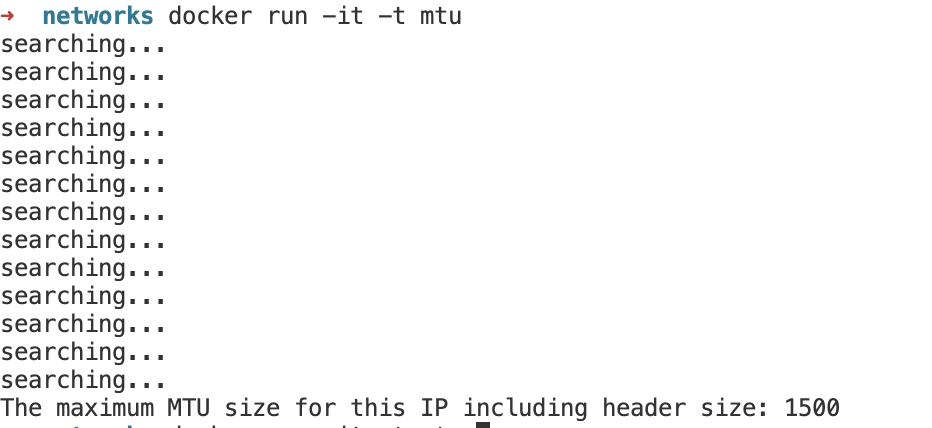

Скрипт на вход принимает ровно один аргумент - хост, в соединении с которым считается MTU. 

Делаю проверки на корректность ввода, на существование и доступность хоста, в случае ошибок бросаю исключения. Также для каждой операционной системы сделала генерацию соответствующей команды.

Аргумент меняется в докерфайле.

```
docker build -t mtu -f Dockerfile . 
docker run -it -t mtu 
```

