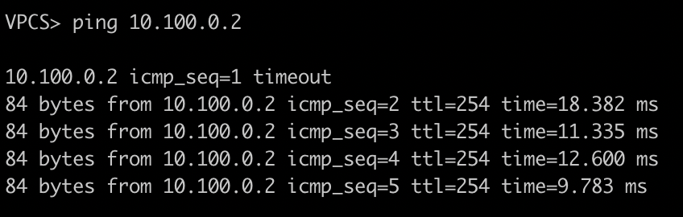

# Топология 


# Инструкции

Настроено без шифрования :(

## VPC5
```
ip 10.0.30.1/24 10.0.30.2
```
## VPC6
```
ip 10.0.10.1/24 10.0.10.2
```
## VPC7
```
ip 10.0.20.1/24 10.0.20.2
```
## R1
```
enable
conf t
interface e0/0
no shutdown
ip address 10.10.1.1 255.255.255.0
exit
interface e0/1
no shutdown
ip address 10.20.1.1 255.255.255.0
exit
interface e0/2
no shutdown
ip address 10.30.1.1 255.255.255.0
exit
exit
```
## R2
```
enable
conf t
interface e0/1
no shutdown
ip address 10.0.30.2 255.255.255.0
exit
interface e0/0
no shutdown
ip address 10.10.1.2 255.255.255.0
exit

ip route 0.0.0.0 0.0.0.0 10.10.1.1
ip route 10.0.10.1 255.255.255.255 10.100.0.2
ip route 10.0.20.1 255.255.255.255 10.200.0.2

interface tunnel 100
ip address 10.100.0.1 255.255.255.0
tunnel source 10.10.1.2
tunnel destination 10.20.1.2
ip mtu 1400
ip tcp adjust-mss 1360
exit

interface tunnel 200
ip address 10.200.0.1 255.255.255.0
tunnel source 10.10.1.2
tunnel destination 10.30.1.2
ip mtu 1400
ip tcp adjust-mss 1360
exit
```
## R3
```
enable
conf t
interface e0/1
no shutdown
ip address 10.0.10.2 255.255.255.0
exit
interface e0/0
no shutdown
ip address 10.20.1.2 255.255.255.0
exit

ip route 0.0.0.0 0.0.0.0 10.20.1.1
ip route 10.0.30.1 255.255.255.255 10.100.0.1

interface tunnel 100
ip address 10.100.0.2 255.255.255.0
tunnel source 10.20.1.2
tunnel destination 10.10.1.2
ip mtu 1400
ip tcp adjust-mss 1360
exit
```
## R4
```
enable
conf t
interface e0/1
no shutdown
ip address 10.0.20.2 255.255.255.0
exit
interface e0/0
no shutdown
ip address 10.30.1.2 255.255.255.0
exit

ip route 0.0.0.0 0.0.0.0 10.30.1.1
ip route 10.0.30.1 255.255.255.255 10.200.0.1

interface tunnel 200
ip address 10.200.0.2 255.255.255.0
tunnel source 10.30.1.2
tunnel destination 10.10.1.2
ip mtu 1400
ip tcp adjust-mss 1360
exit
```
# Работоспособность
Пинги из VPC5 в VPC6 и обратно



Пинги из VPC5 в VPC7 и обратно


Центральный роутер не знает скрытых сетей:

